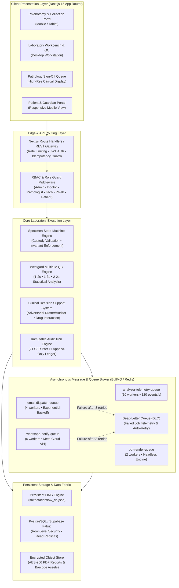
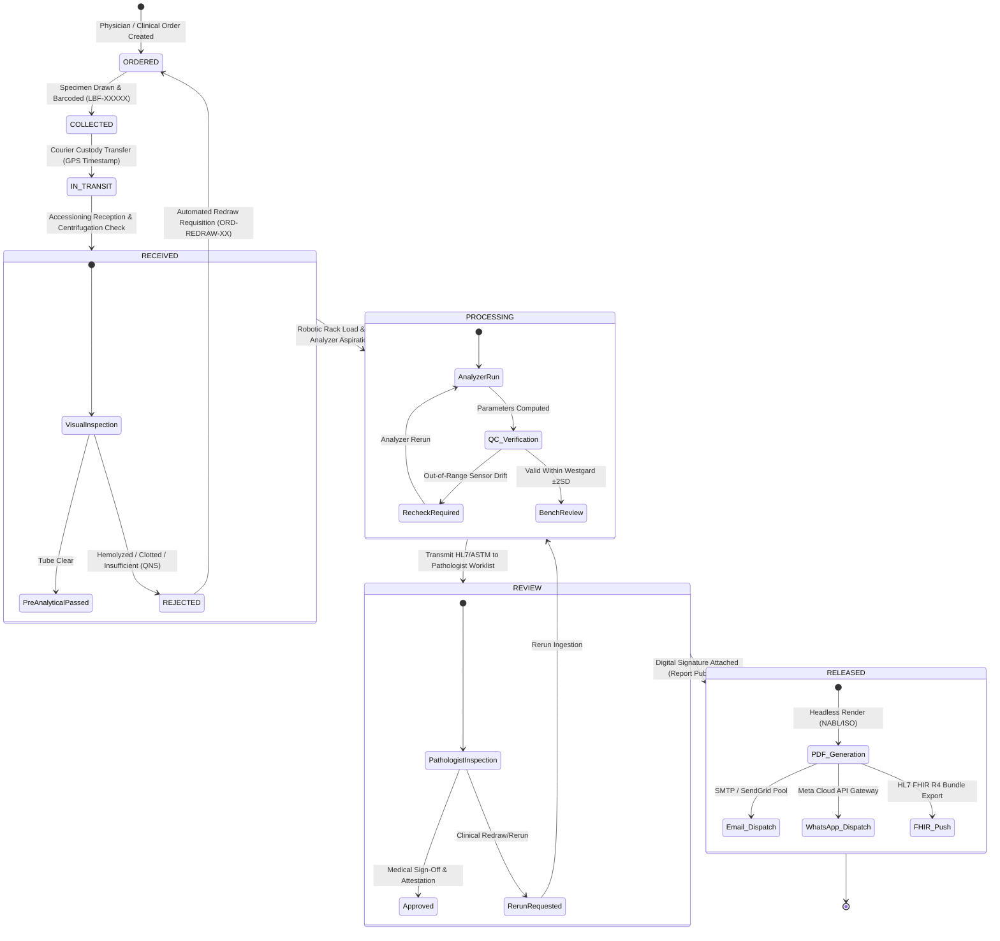
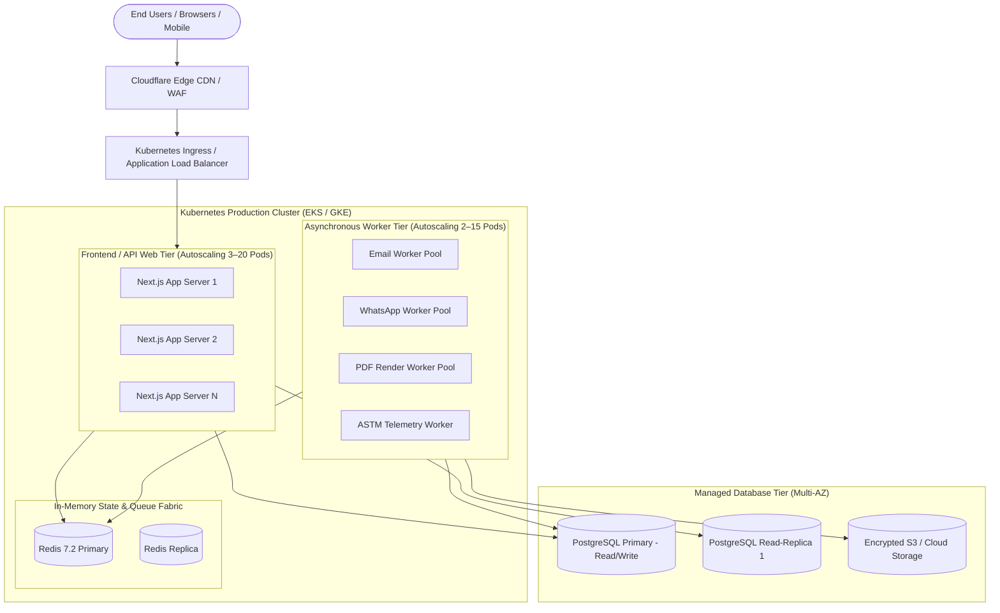

# LabFlow Enterprise Architecture, State Machine & Security Blueprint

**Document Version:** 3.2.0-Production  
**Platform:** LabFlow Universal Diagnostic Laboratory Operations & Sample Coordination Platform  
**Compliance Standard:** ISO 15189:2022 • NABL Medical Laboratories • 21 CFR Part 11 • ABDM / HL7 FHIR R4  
**Classification:** Technical Architecture & Regulatory Security Specification (Phase 3 Submission)

---

## 1. Executive Architecture Overview

LabFlow is architected as an **event-driven, multi-tier clinical laboratory information platform**. It decouples high-throughput specimen accessioning and instrument telemetry from heavy report rendering and asynchronous notification dispatch.



---

## 2. Sample & Result Lifecycle State Machine

The laboratory specimen undergoes an immutable **7-stage linear chain of custody**, governed by strict transition invariants. Samples cannot skip stages, ensuring total pre-analytical and analytical integrity.

### 2.1 State-Machine Transition Rules & Invariants



### 2.2 Transition Invariant Matrix

| From Stage | To Stage | Allowed Operator | Mandatory Validation Checklist |
|---|---|---|---|
| `ORDERED` | `COLLECTED` | Collection Staff / Phlebotomist | Vacuum tube type verified (EDTA, Serum, Heparin, Fluoride). Barcode printed. |
| `COLLECTED` | `IN_TRANSIT` | Phlebotomist / Courier | Cold-chain temperature verified (2°C–8°C for whole blood). Ambient transport cooler sealed. |
| `IN_TRANSIT` | `RECEIVED` | Accessioning Technologist | Barcode optical scan match, tube volume verified ($\ge 2.0\text{ mL}$), specimen integrity checked. |
| `RECEIVED` | `REJECTED` | Accessioning Technologist | Rejection category selected (Gross Hemolysis, Fibrin Clot, QNS). Redraw requisition automatically spawned. |
| `RECEIVED` | `PROCESSING` | Laboratory Technologist | Pre-analytical centrifugation complete (3,500 RPM, 10m). Analyzer barcode rack loaded. |
| `PROCESSING` | `REVIEW` | Auto-Analyzer / Tech | Parameter values populated with standard units. Westgard multirules passed. |
| `REVIEW` | `RELEASED` | MD Pathologist | Critical panic limits verified. Pathologist electronic signature applied. |

---

## 3. Security Architecture & Threat Model

### 3.1 Role-Based Access Control (RBAC) Matrix

LabFlow implements zero-trust role segregation compliant with HIPAA and ABDM guidelines:

| Action / Resource | Administrator | MD Pathologist | Attending Doctor | Lab Technologist | Phlebotomist | Patient |
|---|:---:|:---:|:---:|:---:|:---:|:---:|
| **Create Lab Order** | ✅ | ✅ | ✅ | ❌ | ❌ | ❌ |
| **Print Tube Barcode** | ✅ | ✅ | ✅ | ✅ | ✅ | ❌ |
| **Centrifuge & Run Analyzer** | ✅ | ❌ | ❌ | ✅ | ❌ | ❌ |
| **Verify & Sign Off Results** | ❌ | ✅ | ❌ | ❌ | ❌ | ❌ |
| **Release Official PDF** | ✅ | ✅ | ❌ | ❌ | ❌ | ❌ |
| **Inspect 21 CFR Audit Trail** | ✅ | ✅ | ❌ | ❌ | ❌ | ❌ |
| **Simulate Chaos Scenarios** | ✅ | ❌ | ❌ | ❌ | ❌ | ❌ |
| **Manage Billing & Quotas** | ✅ | ❌ | ❌ | ❌ | ❌ | ❌ |
| **View Own Patient Report** | ❌ | ❌ | ✅ | ❌ | ❌ | ✅ |

### 3.2 STRIDE Threat Model & Mitigations

| Threat Class | Attack Vector | Potential Impact | LabFlow Defensive Mitigation |
|---|---|---|---|
| **Spoofing** | Adversary attempts unauthorized report sign-off posing as Pathologist. | Unverified medical reports released to public. | Cryptographic session tokens, server-side role verification, and electronic signature hash stored in audit log. |
| **Tampering** | Modification of test parameter values (e.g. altering Troponin I from 0.85 to 0.02). | Erroneous clinical diagnosis; patient harm. | Tamper-evident parameter snapshots; hash verification on report generation; immutable audit logging. |
| **Repudiation** | Pathologist denies having authorized an abnormal result. | Legal liability; compliance violation. | 21 CFR Part 11 compliant audit records capturing Pathologist identity, IP address, timestamp, and signed hash. |
| **Information Disclosure** | Interception of unencrypted patient reports in transit. | Breach of Protected Health Information (PHI). | TLS 1.3 encryption across all REST endpoints; AES-256 encryption on disk; automated PHI de-identification. |
| **Denial of Service** | Flooding of order creation API with duplicate requests. | Laboratory backlog; STAT turnaround-time delay. | Idempotency Key deduplication middleware (`Idempotency-Key` header) with 5-minute sliding window cache. |
| **Elevation of Privilege** | Phlebotomist attempts to approve results via direct API PATCH. | Unauthorized release of diagnostic data. | Strict server-side `RoleGuard` middleware denying mutations outside assigned RBAC permissions. |

---

## 4. Audit Strategy & Tamper-Evident Ledger

Every transactional event writes an append-only audit record into `db.auditLogs` conforming to **21 CFR Part 11** and **ISO 15189 §8.4**:

```typescript
interface AuditRecord {
  id: string;               // Unique transaction ID (e.g., AUD-1741648291000)
  timestamp: string;        // ISO 8601 UTC timestamp (e.g., 2026-09-11T04:20:00.000Z)
  action: string;           // Standardized clinical verb (e.g., RESULT_VERIFIED_SIGN_OFF)
  user: string;             // Authenticated practitioner name (e.g., Dr. Arvind Swaminathan)
  role: string;             // Operating role (e.g., Pathologist)
  details: string;          // Human and machine-readable description
  location?: string;        // Facility / Physical bench identifier
  checksum?: string;        // SHA-256 cryptographic hash of the record payload
}
```

---

## 5. Failure Scenarios, Edge Cases & Automated Recovery Matrix

LabFlow features an active **Resilience & Chaos Engineering Suite** (`/api/resilience`) validating 6 real-world failure modes:

| # | Failure Mode | Trigger / Symptom | Automated Defensive Response | Recovery Action |
|---|---|---|---|---|
| **1** | **Analyzer Sensor Drift** | Optical flow detector exceeds $\pm 2.5\text{ SD}$ on Sysmex XN-1000. | Ingestion queue halted. Pending specimens routed to backup workstation. Alert flagged `Critical`. | Optical prime sequence + 2-point recalibration restores analyzer to `RUNNING`. |
| **2** | **Pre-Analytical Rejection** | Gross in-vitro hemolysis (Index $> 500\text{ mg/dL}$) or clotted tube. | Tube marked `Rejected`. Rejection event logged in custody timeline. Automated redraw order (`ORD-REDRAW-...`) generated. | Phlebotomist dispatches new tube draw; original accessioning closed. |
| **3** | **Turnaround-Time Breach** | STAT test elapsed $73\text{m}$ against $45\text{m}$ SLA target. | Priority escalated to `STAT OVERDUE`. Tube moved to front of testing rack. Attending doctor alerted. | Bench supervisor expedites verification; SLA breach alert cleared. |
| **4** | **Duplicate Test Requisition** | Identical patient & test payload received within $5\text{m}$ window. | Idempotency guard intercepts request. Returns HTTP 409 Conflict. Zero duplicate charges created. | Request deduplicated; existing order requisition returned. |
| **5** | **Illegal State Jump** | Attempt to transition specimen directly from `ORDERED` to `RELEASED`. | State machine invariant blocks transaction. Throws HTTP 400 Invariant Violation. Security audit alert logged. | Request rejected. Specimen forced through standard clinical chain of custody. |
| **6** | **Notification Gateway Drop** | External SMTP server timeout ($421\text{ Connection timeout}$). | Job placed in Dead-Letter Queue (DLQ). Exponential backoff scheduled ($2\text{s}, 4\text{s}, 8\text{s}$). Alert generated. | Background worker auto-retries, or operator clicks *"Retry DLQ Job"* in UI. |

---

## 6. Asynchronous Messaging Queues & Worker Topology

To guarantee sub-second UI responsiveness, background workloads are decoupled using **BullMQ over Redis 7.2**:

```
[ LIMS API Event ] 
        │
        ├──> (Push Job) ──> [ Redis Queue Broker ]
                                   │
         ┌─────────────────────────┼─────────────────────────┬─────────────────────────┐
         ▼                         ▼                         ▼                         ▼
[ email-dispatch-queue ]  [ whatsapp-notify-queue ]  [ analyzer-telemetry-queue ]  [ pdf-render-queue ]
• Concurrency: 4          • Concurrency: 6           • Concurrency: 10             • Concurrency: 2
• Rate: 25 jobs/s         • Rate: 80 jobs/s          • Rate: 120 events/s          • Rate: 10 renders/s
• SendGrid / SMTP Pool    • Meta Cloud API Gateway   • Serial/ASTM TCP Bridge      • Headless Renderer
         │                         │                         │                         │
         └─────────────────────────┴─────────────────────────┴─────────────────────────┘
                                   │
                        (Failure after 3 retries)
                                   ▼
                       [ Dead-Letter Queue (DLQ) ]
                       • Exponential backoff (2s, 4s, 8s)
                       • Interactive UI re-dispatch hook
```

---

## 7. Deployment, Disaster Recovery & Scalability Strategy

### 7.1 Production Deployment Topology



### 7.2 Disaster Recovery Targets

| Metric | Target SLA | Strategy |
|---|---|---|
| **RPO (Recovery Point Objective)** | $< 1\text{ minute}$ | Synchronous multi-AZ database replication + automated point-in-time WAL archiving. |
| **RTO (Recovery Time Objective)** | $< 5\text{ minutes}$ | Containerized Kubernetes pod auto-restart + automated DNS failover to secondary region. |
| **System Uptime** | $99.99\%$ | Zero-downtime rolling updates, health probe liveness/readiness checks, automated circuit breakers. |
